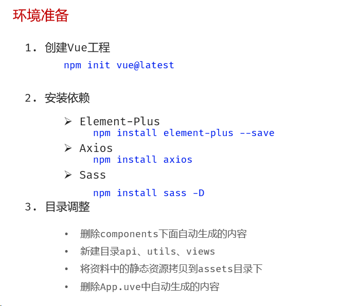

# 一.项目搭建
## 1.项目初始化



# 二、注册

### 2.1 页面搭建

```vue
<script setup>
import { User, Lock } from '@element-plus/icons-vue'
import { ref } from 'vue'
//控制注册与登录表单的显示， 默认显示注册
const isRegister = ref(false)
</script>

<template>
    <el-row class="login-page">
        <el-col :span="12" class="bg"></el-col>
        <el-col :span="6" :offset="3" class="form">
            <!-- 注册表单 -->
            <el-form ref="form" size="large" autocomplete="off" v-if="isRegister">
                <el-form-item>
                    <h1>注册</h1>
                </el-form-item>
                <el-form-item>
                    <el-input :prefix-icon="User" placeholder="请输入用户名"></el-input>
                </el-form-item>
                <el-form-item>
                    <el-input :prefix-icon="Lock" type="password" placeholder="请输入密码"></el-input>
                </el-form-item>
                <el-form-item>
                    <el-input :prefix-icon="Lock" type="password" placeholder="请输入再次密码"></el-input>
                </el-form-item>
                <!-- 注册按钮 -->
                <el-form-item>
                    <el-button class="button" type="primary" auto-insert-space>
                        注册
                    </el-button>
                </el-form-item>
                <el-form-item class="flex">
                    <el-link type="info" :underline="false" @click="isRegister = false">
                        ← 返回
                    </el-link>
                </el-form-item>
            </el-form>
            <!-- 登录表单 -->
            <el-form ref="form" size="large" autocomplete="off" v-else>
                <el-form-item>
                    <h1>登录</h1>
                </el-form-item>
                <el-form-item>
                    <el-input :prefix-icon="User" placeholder="请输入用户名"></el-input>
                </el-form-item>
                <el-form-item>
                    <el-input name="password" :prefix-icon="Lock" type="password" placeholder="请输入密码"></el-input>
                </el-form-item>
                <el-form-item class="flex">
                    <div class="flex">
                        <el-checkbox>记住我</el-checkbox>
                        <el-link type="primary" :underline="false">忘记密码？</el-link>
                    </div>
                </el-form-item>
                <!-- 登录按钮 -->
                <el-form-item>
                    <el-button class="button" type="primary" auto-insert-space>登录</el-button>
                </el-form-item>
                <el-form-item class="flex">
                    <el-link type="info" :underline="false" @click="isRegister = true">
                        注册 →
                    </el-link>
                </el-form-item>
            </el-form>
        </el-col>
    </el-row>
</template>

<style lang="scss" scoped>
/* 样式 */
.login-page {
    height: 100vh;
    background-color: #fff;

    .bg {
        background: url('@/assets/logo2.png') no-repeat 60% center / 240px auto,
            url('@/assets/login_bg.jpg') no-repeat center / cover;
        border-radius: 0 20px 20px 0;
    }

    .form {
        display: flex;
        flex-direction: column;
        justify-content: center;
        user-select: none;

        .title {
            margin: 0 auto;
        }

        .button {
            width: 100%;
        }

        .flex {
            width: 100%;
            display: flex;
            justify-content: space-between;
        }
    }
}
</style>
```

### 2.2 页面数据绑定与事件绑定

#### 2.2.1 数据绑定

```js
//用于注册的数据模型
const registerData = ref({
    username: '',
    password: '',
    rePassword: ''
})
```

#### 2.2.2 表单校验

```js
//自定义确认密码的校验函数
const rePasswordValid = (rule, value, callback) => {
    if (value == null || value === '') {
        return callback(new Error('请再次确认密码'))
    }
    if (registerData.value.password !== value) {
        return callback(new Error('两次输入密码不一致'))
    }
    return callback();
}
//用于注册的表单校验模型
const registerDataRules = ref({
    username: [
        { required: true, message: '请输入用户名', trigger: 'blur' },
        { min: 5, max: 16, message: '用户名的长度必须为5~16位', trigger: 'blur' }
    ],
    password: [
        { required: true, message: '请输入密码', trigger: 'blur' },
        { min: 5, max: 16, message: '密码长度必须为5~16位', trigger: 'blur' }
    ],
    rePassword: [
        { validator: rePasswordValid, trigger: 'blur' }
    ]
})
```

#### 2.2.3 事件绑定

```js
//用于注册的事件函数
const register = () => {
    console.log('注册...');
}
```

